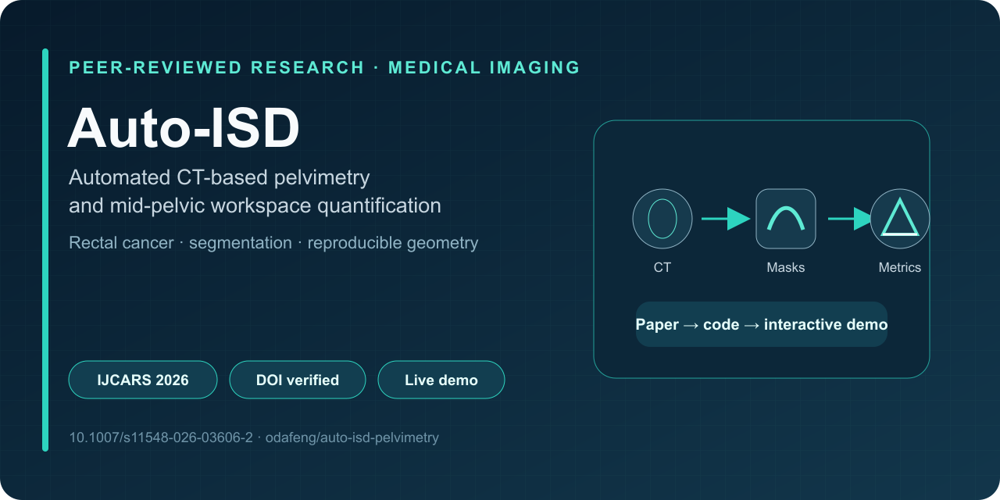

# Auto-ISD: Automated CT-Based Pelvimetry Pipeline

[](https://doi.org/10.1007/s11548-026-03606-2)
[](https://auto-isd-demo.vercel.app/)
[](LICENSE)

<p align="center">
  
</p>

Source code for the automated pelvimetry pipeline described in:

> Huang S-F, Tseng H-P, Hsu C-W. **A fully automated CT-based pelvimetry pipeline for quantifying mid-pelvic surgical workspace in rectal cancer.** *Int J Comput Assist Radiol Surg.* 2026. [DOI: 10.1007/s11548-026-03606-2](https://doi.org/10.1007/s11548-026-03606-2)

| Research artifact | Evidence |
| --- | --- |
| **Publication** | Peer-reviewed article in *IJCARS* |
| **Reproduction** | Core Python implementation, demo CT, segmentation masks, and QC notebook |
| **Interactive explanation** | [Live scrollytelling demo](https://auto-isd-demo.vercel.app/) |
| **Reusable package** | Maintained separately as [`ctpelvimetry`](https://github.com/odafeng/ctpelvimetry) |

## Overview

The pipeline automates the extraction of key anatomical metrics from routine staging CT scans:
1.  **Interspinous Distance (ISD)**: The narrowest transverse distance at the ischial spine level, identified via valley detection or plateau fallback.
2.  **Posterior Pelvic Triangle**: Area, depth, and shape index — a geometric representation of the mid-pelvic surgical workspace.
3.  **Soft Tissue Occupancy**: Bowel area, posterior pelvic fat area (pPFA), occupancy ratios, and residual working space.

## Prerequisites

1.  **Python 3.8+**
2.  **Input Data Requirements**: 
    To run the analysis code, you must first process your CT scans to obtain:
    *   **Original CT Image**: In NIfTI format (`.nii.gz`).
    *   **Segmentation Masks**: Generated via [TotalSegmentator](https://github.com/wasserth/TotalSegmentator). The following masks are required:
        *   `femur_left.nii.gz`, `femur_right.nii.gz`
        *   `hip_left.nii.gz`, `hip_right.nii.gz`
        *   `sacrum.nii.gz`
        *   `colon.nii.gz`
        *   `torso_fat.nii.gz` (for body composition)

    > **Citation for TotalSegmentator**:
    > Wasserthal, J., Breit, H. C., Meyer, M. T., Pradella, M., Hinck, D., Sauter, A. W., Heye, T., Boll, D. T., Cyriac, J., Yang, S., Bach, M., & Segeroth, M. (2023). TotalSegmentator: Robust Segmentation of 104 Anatomic Structures in CT Images. Radiology. Artificial intelligence, 5(5), e230024. [DOI](https://doi.org/10.1148/ryai.230024)

## Installation

1.  Clone this repository or download the source code.
2.  Install Python dependencies:

```bash
pip install -r requirements.txt
```

3.  Ensure `TotalSegmentator` is installed if you need to generate masks from scratch:

```bash
pip install TotalSegmentator
```

### TotalSegmentator License

Bone-based metrics (ISD, triangle geometry) work with the **free version** of TotalSegmentator — no license needed.

For **soft tissue metrics** (pPFA, working space), the `tissue_types` task requires an academic license:

```bash
# 1. Apply for an academic license at:
#    https://github.com/wasserth/TotalSegmentator#license

# 2. Set the license as an environment variable:
export TOTALSEG_LICENSE='your_license_key_here'

# 3. Register the license:
totalseg_set_license -l $TOTALSEG_LICENSE
```

> **Note:** If you only need bone-derived pelvimetry (ISD, triangle area/depth), you can skip the license step entirely. The pipeline will still compute all bone-based metrics successfully.

## Usage

### 1. Demo Data
A `Demo` folder is included in this package containing a sample patient:
*   `Demo/Patient_CT.nii.gz`: Original CT.
*   `Demo/*.nii.gz`: Pre-computed segmentation masks.
You can use this data to verify the code immediately.

### 2. Running the Code
The provided code performs two distinct tasks:

#### A. Metric Calculation (`Pelvimetry_Demo.ipynb`)
Calculates all anatomical metrics (ISD, APD, Triangle Area, pPFA, Working Space, etc.) and outputs them numerically.
*   **Input**: NIfTI file + Segmentation Masks folder.
*   **Output**: Printed metrics and coordinate points.

#### B. QC Figure Generation (`Generate_QC_Plot.ipynb`)
Generates a publication-quality Quality Control (QC) figure showing the anatomical landmarks and the ISD search profile curve.
*   **Input**: NIfTI file + Segmentation Masks folder.
*   **Output**: A high-resolution PNG file (`Demo_QC_Plot.png`) visualizing the analysis.

### 3. Library Usage
The core logic is encapsulated in `pelvimetry_core.py`. You can import `AutomatedPelvimetry` to analyze your own NIfTI files.

```python
from pelvimetry_core import AutomatedPelvimetry

# Initialize
pipeline = AutomatedPelvimetry()

# Run Analysis
# Note: Ensure segmentation masks are present in 'seg_output_dir'
results = pipeline.pipeline_single_case(
    nifti_path="path/to/patient_ct.nii.gz",
    seg_output_dir="path/to/output_folder_with_masks"
)

print(f"ISD: {results['ISD_mm']} mm")
```

## Citation

If you use this code in your research, please cite:

```bibtex
@article{huang2026autoiSD,
  title={A fully automated CT-based pelvimetry pipeline for quantifying mid-pelvic surgical workspace in rectal cancer},
  author={Huang, Shih-Feng and Tseng, Hsin-Ping and Hsu, Chao-Wen},
  journal={International Journal of Computer Assisted Radiology and Surgery},
  year={2026},
  doi={10.1007/s11548-026-03606-2}
}
```

## License

MIT License — Academic use encouraged. See [LICENSE](LICENSE) for details.

Machine-readable citation metadata are available in [`CITATION.cff`](CITATION.cff).
